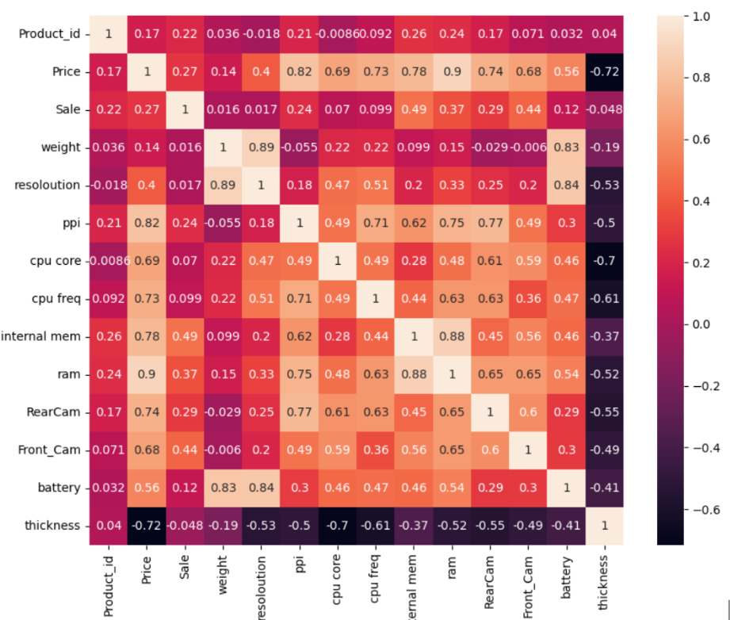
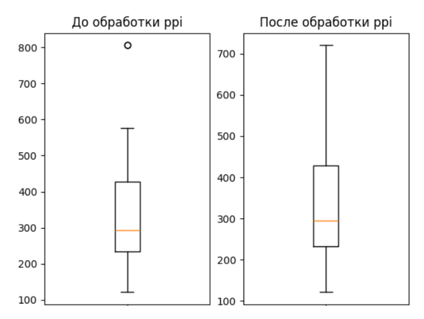
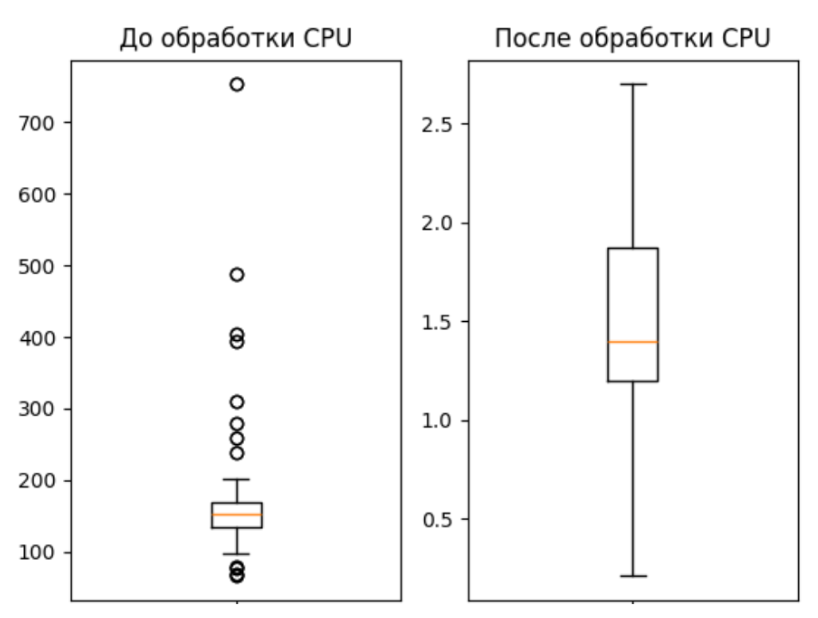
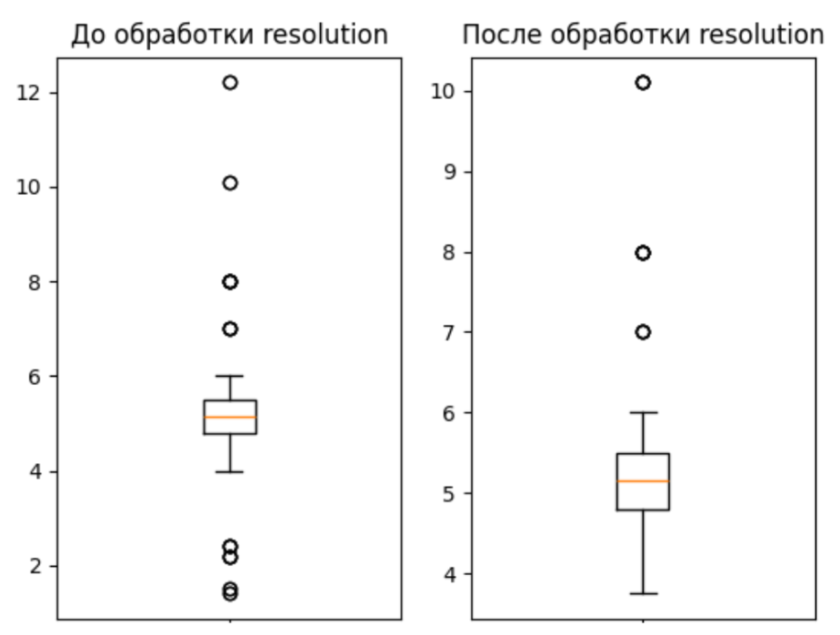
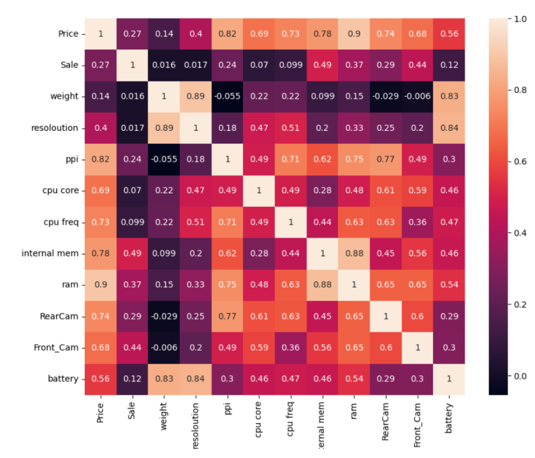

# Forecasting-prices-for-mobile-devices
Прогнозирование цен на мобильные устройства с использованием методов машинного обучения
- [Ссылка на датасет, который анализировался](https://www.kaggle.com/datasets/mohannapd/mobile-price-prediction)
- Более подробный отчет по проведённой работе можно прочитать в файле 'Отчёт.docx'
## Описание данных
Объем данных – 17,7 кб
### Типы, виды данных и схемы кодирования

| Наименование     | Тип данных               | Вид данных   | Схема кодирования |
|------------------|--------------------------|--------------|-------------------|
| Product_id       | Целое число               | Дискретный   | Целое число       |
| Price            | Целое число               | Непрерывный  | Целое число       |
| Sale             | Целое число               | Непрерывный  | Целое число       |
| Weight           | Число с плавающей точкой  | Дискретный   | Целое число       |
| Resolоution       | Число с плавающей точкой  | Дискретный   | Целое число       |
| PPI              | Целое число               | Дискретный   | Целое число       |
| CPU core         | Целое число               | Дискретный   | Целое число       |
| CPU freq         | Число с плавающей точкой  | Дискретный   | Целое число       |
| Internal mem     | Число с плавающей точкой  | Дискретный   | Целое число       |
| RAM              | Число с плавающей точкой  | Дискретный   | Целое число       |
| RearCam          | Число с плавающей точкой  | Дискретный   | Целое число       |
| Front_Cam        | Число с плавающей точкой  | Дискретный   | Целое число       |
| Battery          | Целое число               | Дискретный   | Целое число       |
| Thickness        | Число с плавающей точкой  | Дискретный   | Целое число       |
-  Формат данных – файл csv, разделитель – “,”.
- В ходе проверки данных было выяснено, что прощуенные значения и дубликаты отсутствуют.
## Матрица корреляций

## Анализ выбросов
Был проведен анализ на наличие выбросов на основе ящиков с усами, представленных в прошлой главе, и вот решение:
- **Product_id, CPU core, RAM, RearCam, Front_Cam**: В этих признаках выбросов нет.
- **Sale**: Было принято не очищать от выбросов.
- **Weight**: Необходимо заменить значения, меньшие нижней границы, на нижнюю границу, а значения, большие верхней границы, на верхнюю границу.
- **Resolution**: Необходимо заменить значения, меньшие нижней границы, на нижнюю границу, а значения, большие верхней границы, на второе по величине значение среди выбросов.
- **PPI**: Необходимо заменить выбросы на верхнюю границу.
- **CPU freq**: Необходимо заменить значение 0 на 0.5, потому что минимальная частота процессора должна быть не менее 0.5.
- **Internal mem, Battery**: Выбросы не нужно удалять, так как это могут быть реальные значения.
- Признак **Product_id** отбрасываем, так как он слабо влияет на результат, что видно по корреляционной матрице.
## Очистка выбросов
- На изображениях ниже реализована очиска выбросов в соответсвии с тем, как это было описано выше

## Матрица корреляций после очистки выбросов

