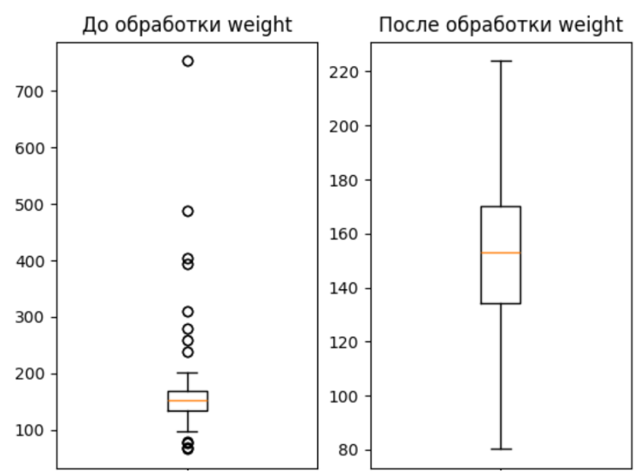
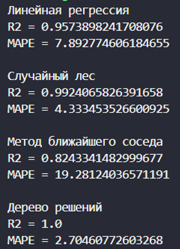
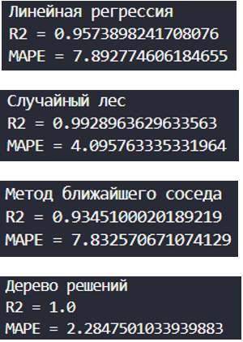

# Forecasting-prices-for-mobile-devices
Прогнозирование цен на мобильные устройства с использованием методов машинного обучения
- [Ссылка на датасет, который анализировался](https://www.kaggle.com/datasets/mohannapd/mobile-price-prediction)
- Более подробный отчет по проведённой работе можно прочитать в файле **Отчёт.docx**
## Бизнес-задачи
В наши дни мы смело можем отследить тенденцию возрастания цен на гаджеты на российском рынке. С каждым днем повышается вероятность покупки и продажи техники по параллельному импорту. Возрастает конкуренция среди магазинов мобильных устройств. Сеть магазинов терпит убытки и сокращение прибыли в связи с ростом конкуренции в секторе и ростом цен поставщиков, вызванным ситуацией в мире и колебаниями на валютном рынке.

### В связи с этим возникают следующие задачи:
1. Оптимальное ценообразование;
2. Анализ рынка;
3. Изучение конкурентов и их действий;
4. Анализ отклонений факта от плана продаж, выручки, прибыли;
5. Совершенствование ассортимента товаров (расширение ассортимента востребованных категорий и уменьшение невостребованных).

### Ожидаемые преимущества:
- Увеличение прибыли за счет привлечения клиентов.

### Критерий успеха:
- Увеличение продаж в результате оптимальной постановки цен.

### Критерии успешности изучения данных:
Метрики оценки точности и качества построенных моделей:
- Для моделей регрессии: качество модели определяется с использованием коэффициента детерминации (R2), точность модели определяется на основании средней относительной ошибки (MAPE).
- Границы значений метрик: R2 должен быть больше либо равен 0.8, MAPE не более 10%.

## Описание данных
Объем данных – 17,7 кб
### Типы, виды данных и схемы кодирования

| Наименование     | Тип данных               | Вид данных   | Схема кодирования |
|------------------|--------------------------|--------------|-------------------|
| Product_id       | Целое число               | Дискретный   | Целое число       |
| Price            | Целое число               | Непрерывный  | Целое число       |
| Sale             | Целое число               | Непрерывный  | Целое число       |
| Weight           | Число с плавающей точкой  | Дискретный   | Целое число       |
| Resolоution       | Число с плавающей точкой  | Дискретный   | Целое число       |
| PPI              | Целое число               | Дискретный   | Целое число       |
| CPU core         | Целое число               | Дискретный   | Целое число       |
| CPU freq         | Число с плавающей точкой  | Дискретный   | Целое число       |
| Internal mem     | Число с плавающей точкой  | Дискретный   | Целое число       |
| RAM              | Число с плавающей точкой  | Дискретный   | Целое число       |
| RearCam          | Число с плавающей точкой  | Дискретный   | Целое число       |
| Front_Cam        | Число с плавающей точкой  | Дискретный   | Целое число       |
| Battery          | Целое число               | Дискретный   | Целое число       |
| Thickness        | Число с плавающей точкой  | Дискретный   | Целое число       |
-  Формат данных – файл csv, разделитель – “,”.
- В ходе проверки данных было выяснено, что прощуенные значения и дубликаты отсутствуют.
## Матрица корреляций

## Анализ выбросов
Был проведен анализ на наличие выбросов на основе ящиков с усами, представленных в прошлой главе, и вот решение:
- **Product_id, CPU core, RAM, RearCam, Front_Cam**: В этих признаках выбросов нет.
- **Sale**: Было принято не очищать от выбросов.
- **Weight**: Необходимо заменить значения, меньшие нижней границы, на нижнюю границу, а значения, большие верхней границы, на верхнюю границу.
- **Resolution**: Необходимо заменить значения, меньшие нижней границы, на нижнюю границу, а значения, большие верхней границы, на второе по величине значение среди выбросов.
- **PPI**: Необходимо заменить выбросы на верхнюю границу.
- **CPU freq**: Необходимо заменить значение 0 на 0.5, потому что минимальная частота процессора должна быть не менее 0.5.
- **Internal mem, Battery**: Выбросы не нужно удалять, так как это могут быть реальные значения.
- Признак **Product_id** отбрасываем, так как он слабо влияет на результат, что видно по корреляционной матрице.
## Очистка выбросов
- На изображениях ниже реализована очиска выбросов в соответсвии с тем, как это было описано выше

## Матрица корреляций после очистки выбросов

## Моделирование 
- Результаты моделей с данными, которые не прошли нормализацию и стандартизацию  

- Вот методы которые были использованы для улучшения показателей R2 и MAPE:  
1) Дерево решений – стандартизация
2)	Случайный лес – нормализация и стандартизация
3)	Метод ближайшего соседа – нормализация
На значения линейной регрессии данные изменения не оказывали значительного влияния

